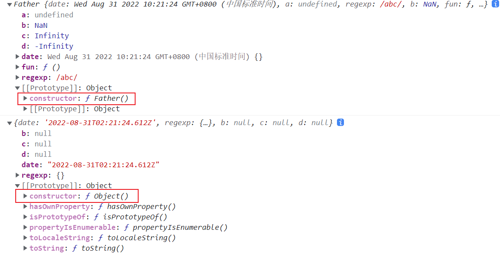
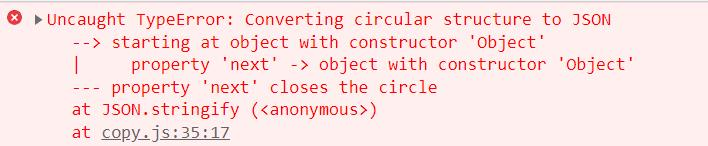
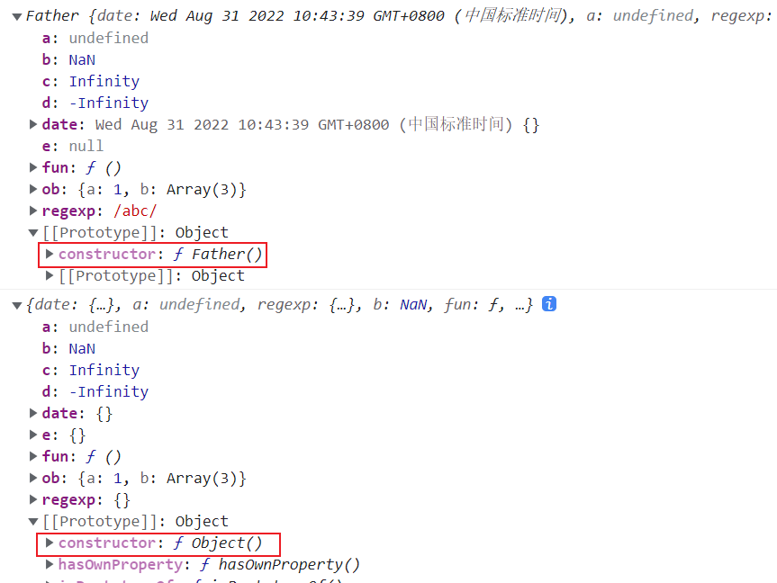

## 1、防抖

原理：不管事件触发多少次，都是以最新的一次开始执行

采用定时器 实现设定时间之后才触发 设定时间之内再次触发 会重新计时

```js
function debounce(func, wait) {
  var timeout;
  return function () {
    clearTimeout(timeout)
    timeout = setTimeout(func, wait);
  }
}
```

### 不改变其 this 指向

```js
function debounce(func, wait) {
  var timeout;
  return function () {
    var context = this;
    clearTimeout(timeout)
    timeout = setTimeout(() => {
      func.apply(context)
    }, wait);
  }
}
```

### event 对象

JavaScript 在事件处理函数中会提供事件对象event
不使用 debouce 函数，会打印出 MouseEvent 对象，但是用了debouce函数却打印出 undefined

所以修改一下代码

```js
function debounce(func, wait) {
  var timeout;
  return function () {
    var context = this;
    var args = arguments
    clearTimeout(timeout)
    timeout = setTimeout(() => {
      func.apply(context, args)
    }, wait);
  }
}
```

### 立即执行

我们想要事件触发后函数立即执行，等到停止触发n秒后，才能重新触发执行
加一个 immediate 参数判断是否是立刻执行。

```js
function debounce(func, wait, immediate = false) {
  var timeout = null, result;

  return function() {
    var context = this;
    var args = arguments

    if (immediate && timeout == null) {
      result = func.apply(context, args)
      timeout = setTimeout(() => {
        timeout = null
      }, wait);

      return result;
    }

    clearTimeout(timeout)
    timeout = setTimeout(() => {
      func.apply(context, args)
    }, wait);
  }
}
```

### 取消

最后我们再思考一个小需求，我希望能取消 debounce 函数，比如说我 debounce 的时间间隔是 10 秒钟，immediate 为 true，这样的话，我只有等 10 秒后才能重新触发事件，现在我希望有一个按钮，点击后，取消防抖，这样我再去触发，就可以又立刻执行啦，是不是很开心？

```js
function debounce(func, wait, immediate = false) {
  var timeout = null, result;

  function debounced() {
    var context = this;
    var args = arguments

    if (immediate && timeout == null) {
      result = func.apply(context, args)
      timeout = setTimeout(() => {
        timeout = null
      }, wait);

      return result;
    }

    clearTimeout(timeout)
    timeout = setTimeout(() => {
      func.apply(context, args)
    }, wait);
  }

  if (immediate) {
    debounced.cancel = function () {
      clearTimeout(timeout);
      timeout = null
    }
  }

  return debounced
}
```

## 2、节流

原理：如果持续触发事件，在预设的时间间隔内，只会执行一次事件，每隔一段时间执行一次。

根据首次是否执行以及结束后是否执行，效果有所不同，实现的方式也有所不同。
我们用 leading 代表首次是否执行，trailing 代表结束后是否再执行一次。

关于节流的实现，有两种主流的实现方式，一种是使用时间戳，一种是设置定时器。

还是用 debounced 那个例子

```js
var container = document.querySelector('#container')
let count = 0

var getUserAction = function (e) {
  container.innerText = count++
}

var setUseAction = throttle(getUserAction, 1000);

container.addEventListener('mousemove', setUseAction)
```

### 使用时间戳

```js
function throttle(func, wait) {
  var context, args;
  var previous = 0;

  return function () {
    /**
     * 不用加号是  Thu Sep 01 2022 18:52:49 GMT+0800 (中国标准时间)
     * 用加号是 时间戳
     */
    var now = +new Date();
    context = this;
    args = arguments;
    if (now - previous > wait) {
      func.apply(context, args);
      previous = now;
    }
  }
}
```

### 使用定时器

```js
function throttle(func, wait) {
  var timeout = null;
  var context, args;

  return function () {
    context = this;
    args = arguments;
    if (!timeout) {
      func.apply(context, args)
      timeout = setTimeout(() => {
        timeout = null
      }, wait);
    }
  }
}
```

以上两种写法能达到的效果是：鼠标移入立刻执行，每隔1秒再执行一次，假设在3.2秒停止鼠标移动，4秒的时候不会有再执行一次，叫做**有头无尾**

那怎么实现移入一秒后开始执行，在3.2秒停止鼠标移动，4秒的时候再执行一次呢？也就是**无头有尾**

还是利用定时器，稍作修改

```js
function throttle(func, wait) {
  var timeout = null;
  var context, args;

  return function () {
    context = this;
    args = arguments;
    if (!timeout) {
      timeout = setTimeout(() => {
        timeout = null
        func.apply(context, args)
      }, wait);
    }
  }
}
```

### 有头有尾

如果两个都要，既要进入立即执行，又要停止触发时再执行一次，俗称**有头有尾**

```js
function throttle(func, wait) {
  var context, args;
  var previous = 0;
  var timeout = null;

  return function () {
    context = this;
    args = arguments;
    var now = +new Date();
    // 计算下次触发 func 函数剩余时间
    var remaining = wait - (now - previous)
    // 如果剩余时间小于零，就是时间到该执行函数了 || 后面是系统时间被修改的情况
    if (remaining <= 0 || remaining > wait) {
      if (timeout) {
        clearTimeout(timeout);
        timeout = null;
      }
      func.apply(context, args);
      previous = now;
    }
    // 时间没到的话，设置一个定时器，匹配不再触发函数的情况，时间一到就执行
    else if (!timeout) {
      timeout = setTimeout(() => {
        // 更新previous时间，不然会出现func函数连续调用两次
        previous = +new Date()
        timeout = null
        func.apply(context, args);
      }, remaining);
    }
  }
}
```

### 参数配置

现在想要有个配置参数，可以让我任选一种模式使用**有头有尾、无头有尾、有头无尾**

那我们设置个 options 作为第三个参数，然后根据传的值判断到底哪种效果，我们约定:

leading: false 表示禁用第一次执行
trailing: false 表示禁用停止触发的回调

```js
function throttle(func, wait, options) {
  var context, args;
  var previous = 0;
  var timeout = null;
  /**
   * leading: false 表示禁用第一次执行
   * trailing: false 表示禁用停止触发的回调
   * 默认有头无尾
   */
  var { leading = true, trailing = false } = options || {}

  return function () {
    context = this;
    args = arguments;
    /**
     * 不用加号是  Thu Sep 01 2022 18:52:49 GMT+0800 (中国标准时间)
     * 用加号是 时间戳
     */
    var now = +new Date();
    // 有头：就0开始remaining会为负立即执行一次；无头：remaining === wait走下面
    !previous && (previous = leading ? 0 : now)
    // 计算下次触发 func 函数剩余时间
    var remaining = wait - (now - previous)
    // 如果剩余时间小于零，就是时间到该执行函数了
    if (remaining <= 0 || remaining > wait) {
      if (timeout) {
        clearTimeout(timeout);
        timeout = null;
      }
      func.apply(context, args);
      previous = now;
    }
    // 时间没到的话，设置一个定时器，匹配不再触发函数的情况，时间一到就执行
    else if (!timeout && trailing) {
      timeout = setTimeout(() => {
        // 更新previous时间，不然会出现func函数连续调用两次
        previous = leading ? +new Date() : 0
        timeout = null
        func.apply(context, args);
      }, remaining);
    }
  }
}
```

### 易懂版本

```js
/**
 *
 * @param {function} fn 要节流的函数
 * @param {number} wait 需要节流的毫秒
 * @param {boolean} leading 首次是否执行
 * @param {boolean} trailing 最后一次是否执行
 */
function throttle(fn, wait = 200, leading = true, trailing = false) {
  let timer = null
  let previous = 0

  return function (...args) {
    const now = Date.now()

    if (leading === false && previous === 0) {
      previous = now
    }

    if (timer != null) {
      clearTimeout(timer)
    }

    if (now - previous > wait) {
      fn.apply(this, args)
      previous = now
    } else if (trailing) {
      timer = setTimeout(() => {
        fn.apply(this, args)
        previous = 0
        timer = null
      }, wait)
    }
  }
}
```

## 3、深浅拷贝

### 数组的浅拷贝

利用数组方法进行拷贝，例如: `concat slice`

```js
var arr = ['old', 1, true, null, undefined];
var new_arr = arr.concat();
new_arr[0] = 'new';
console.log(arr) // ["old", 1, true, null, undefined]
console.log(new_arr) // ["new", 1, true, null, undefined]
```

slice 同理

```js
var new_arr = arr.slice();
```

如果数组嵌套了引用值类型数据：对象或数组

```js
var arr = [{ old: 'old' }, ['old']];

var new_arr = arr.concat();

new_arr[0].old = 'new';
new_arr[1][0] = 'new'

console.log(arr) // [ { old: 'new' }, [ 'new' ] ]
console.log(new_arr) // [ { old: 'new' }, [ 'new' ] ]
```

可见slice和concat对数组的拷贝是一种浅拷贝，
数组中的元素是原始值就会拷贝一份，如果是引用值就是拷贝其引用，这样一来对新旧数组进行修改都会互相影响

深拷贝则是完全的拷贝一个对象，即使是嵌套对象，修改新对象也不会对原对象造成影响

### 数组的深拷贝

#### JSON实现的弊端

利用JSON拷贝

```js
var arr = ['old', 1, true, ['old1', 'old2'], {old: 1}]
var new_arr = JSON.parse( JSON.stringify(arr) );
console.log(new_arr);
```

简单粗暴，但是缺点很多

+ 时间对象会变成字符串
+ 函数或者 undefined 会丢失
+ RegExp、NodeList 等特殊对象会变成空对象
+ NaN、 Infinity、 -Infinity 会变成 null
+ 会抛弃对象的 constructor，所有的构造函数会指向 Object



+ 对象有循环引用，会报错

```js
const a = {}
const b = { next: a }
a.next = b
JSON.parse(JSON.stringify(a))
```



### 浅拷贝的实现

实现对一个对象或数组进行浅拷贝

```js
var shallowCopy = function (obj) {
  if (typeof obj !== 'object') return;
  var newObj = obj instanceof Array ? [] : {}
  for (var key in obj) {
    if (obj.hasOwnProperty(key)) {
      newObj[key] = obj[key]
    }
  }
  return newObj;
}
```

### 简版深拷贝

```js
var deepCopy = function (obj) {
  if (typeof obj !== 'object') return;
  var newObj = obj instanceof Array ? [] : {}
  for (var key in obj) {
    if (obj.hasOwnProperty(key)) {
      newObj[key] = typeof obj[key] === 'object' ? deepCopy(obj[key]) : obj[key]
    }
  }
  return newObj;
}
```

但是这样的实现也还存在一些问题



+ 会抛弃对象的 constructor，所有的构造函数会指向 Object
+ date RegExp null 等不可枚举的类型 会变成空对象


### 完美版深拷贝

评价一个深拷贝是否完善，请检查以下问题是否都实现了：

+ 基本类型数据是否能拷贝？
+ 键和值都是基本类型的普通对象是否能拷贝？
+ Symbol作为对象的key是否能拷贝？
+ Date和RegExp对象类型是否能拷贝？
+ Map和Set对象类型是否能拷贝？
+ Function对象类型是否能拷贝？（函数我们一般不用深拷贝）
+ 对象的原型是否能拷贝？
+ 不可枚举属性是否能拷贝？
+ 循环引用是否能拷贝？


```js
function deepClone(source) {
  // 采用WeakMap 构建 Hash表处理循环引用，WeakMap 有利于垃圾回收
  const cache = new WeakMap()
  // 策略模式缓存每种对象数据类型的处理方式 返回一个函数
  let targetResult = {
    Function: function (source) {
      return new Function('return ' + source.toString())()
    },
    // 日期或者正则对象则直接构造一个新的对象返回
    Date: function (source) {
      return new Date(source)
    },
    RegExp: function (source) {
      return new RegExp(source)
    },
    // Map 和 Set new 一个新的实例 注意内部存的值也需要进行递归深拷贝
    Map: function (source) {
      let result = new Map()
      cache.set(source, result) // 设置缓存要在递归之前，才能处理循环引用
      source.forEach((val, key) => {
        result.set(key, clone(val))
      })
      return result
    },
    Set: function (source) {
      let result = new Set()
      cache.set(source, result) // 设置缓存要在递归之前，才能处理循环引用
      source.forEach((val, key) => {
        result.add(clone(val))
      })
      return result
    },
    Array: function (source) {
      let result = []
      cache.set(source, result) // 设置缓存要在递归之前，才能处理循环引用
      source.forEach(val => {
        result.push(clone(val))
      })
      return result
    },
    Object: function (source) {
      // Reflect.ownKeys能够遍历对象的不可枚举属性以及 Symbol 类型，
      const keys = Reflect.ownKeys(source)
      // Object.getOwnPropertyDescriptors()设置属性描述对象
      const allDesc = Object.getOwnPropertyDescriptors(source)
      // Object.create()方式继承原型链
      const result = Object.create(Object.getPrototypeOf(source), allDesc)
      cache.set(source, result) // 设置缓存要在递归之前，才能处理循环引用
      // Object.create()是浅拷贝 递归执行实现深拷贝
      keys.forEach(key => {
        result[key] = clone(source[key])
      })
      return result
    },
  }

  function clone(source) {
    // 基础数据类型 直接返回 包括 null
    if (source instanceof Object === false) return source
    // 如果有缓存，就从缓存中取
    if (cache.has(source)) return cache.get(source)
    // [object Object] 截取第9个到倒数第1个字符 Object
    let sourceType = Object.prototype.toString.call(source).slice(8, -1)
    // 拿到拷贝完成的结果
    let result = targetResult[sourceType](source)
    return result
  }

  return clone(source)
}
```

## 4、Promise

### 简版Promise

```js
class MyPromise {
  constructor(executor) {
    this.state = 'pending';
    this.value = undefined;
    this.reason = undefined;
    this.onFulfilledCallbacks = [];
    this.onRejectedCallbacks = [];

    const resolve = (value) => {
      if (this.state === 'pending') {
        this.state = 'fulfilled';
        this.value = value;
        this.onFulfilledCallbacks.forEach((callback) => callback(this.value));
      }
    };

    const reject = (reason) => {
      if (this.state === 'pending') {
        this.state = 'rejected';
        this.reason = reason;
        this.onRejectedCallbacks.forEach((callback) => callback(this.reason));
      }
    };


    try {
      executor(resolve, reject);
    } catch (error) {
      reject(error);
    }

  }

  then(onFulfilled, onRejected) {
    const newPromise = new MyPromise((resolve, reject) => {
      const onFulfilledCallback = (value) => {
        try {
          const newValue = onFulfilled(value);
          if (newValue instanceof MyPromise) {
            newValue.then(resolve, reject);
          } else {
            resolve(newValue);
          }
        } catch (error) {
          reject(error);
        }
      };

      const onRejectedCallback = (reason) => {
        try {
          const newReason = onRejected(reason);
          if (newReason instanceof MyPromise) {
            newReason.then(resolve, reject);
          } else {
            reject(newReason);
          }
        } catch (error) {
          reject(error);
        }
      };
      switch (this.state) {
        case 'pending': this.onFulfilledCallbacks.push(onFulfilledCallback);
          this.onRejectedCallbacks.push(onRejectedCallback);
          break;
        case 'fulfilled': onFulfilledCallback(this.value);
          break;
        case 'rejected': onRejectedCallback(this.reason);
          break;
      }
    });
    return newPromise;
  }

  catch(onRejected) {
    return this.then(null, onRejected);
  }
}
```

### 完整版Promise

```js
// 手写Promise

// 先定义三个常量表示状态
const PENDING = 'pending';
const FULFILLED = 'fulfilled';
const REJECTED = 'rejected';

class MyPromise {
  constructor(executor) {
    // executor 是一个执行器 进入会立即执行
    try {
      executor(this.resolve, this.reject)
    } catch (error) {
      this.reject(error)
    }
  }

  // 储存状态的变量，初始值是 pending
  status = PENDING;

  // resolve和reject为什么要用箭头函数？
  // 如果直接调用的话，普通函数this指向的是window或者undefined
  // 用箭头函数就可以让this指向当前实例对象

  // 成功之后的值
  value = null;
  // 失败之后的原因
  reason = null;

  // 存储成功回调函数
  onFulfilledCallback = [];
  // 存储失败回调函数
  onRejectedCallback = [];

  // 更改成功后的状态
  resolve = (value) => {
    // 只有状态是等待，才执行状态修改
    if (this.status === PENDING) {
      if (value instanceof MyPromise) {
        return value.then(this.resolve, this.reject)
      }

      // 状态修改为成功
      this.status = FULFILLED;
      // 保存成功之后的值
      this.value = value;
      // 判断成功回调是否存在，如果存在就调用
      while (this.onFulfilledCallback.length) {
        this.onFulfilledCallback.shift()(value);
      }
    }
  }

  // 更改失败后的状态
  reject = (reason) => {
    // 只有状态是等待，才执行状态修改
    if (this.status === PENDING) {
      // 状态修改为成功
      this.status = REJECTED;
      // 保存失败之后的原因
      this.reason = reason;
      // 判断失败回调是否存在，如果存在就调用
      while (this.onRejectedCallback.length) {
        this.onRejectedCallback.shift()(reason)
      }
    }
  }

  then(onFulfilled, onRejected) {
    // 原生 MyPromise 的 then 方法是可以选择参数的单传或者不传，都不会影响执行
    const realOnFulfilled = typeof onFulfilled === 'function' ? onFulfilled : value => value;
    const realOnRejected = typeof onRejected === 'function' ? onRejected : reason => { throw reason }

    // 为了链式调用这里直接创建一个 Promise，并在后面 return 出去
    const promise2 = new MyPromise((resolve, reject) => {

      const fulfilledMicrotask = () => {
        // 创建一个微任务等待 promise2 完成初始化
        queueMicrotask(() => {
          try {
            // 获取成功回调函数的执行结果
            const x = realOnFulfilled(this.value);
            // 传入 resolvePromise 集中处理
            resolvePromise(promise2, x, resolve, reject);
          } catch (error) {
            reject(error)
          }
        })
      }

      const rejectedMicrotask = () => {
        // 创建一个微任务等待 promise2 完成初始化
        queueMicrotask(() => {
          try {
            // 调用失败回调，并且把原因返回
            const x = realOnRejected(this.reason);
            // 传入 resolvePromise 集中处理
            resolvePromise(promise2, x, resolve, reject);
          } catch (error) {
            reject(error)
          }
        })
      }

      // 这里的内容在执行器中，会立即执行
      if (this.status === FULFILLED) {
        fulfilledMicrotask()
      } else if (this.status === REJECTED) {
        rejectedMicrotask()
      } else if (this.status === PENDING) {
        // ==== 新增 ====
        // 因为不知道后面状态的变化情况，所以将成功回调和失败回调存储起来
        // 等到执行成功失败函数的时候再传递
        this.onFulfilledCallback.push(fulfilledMicrotask);
        this.onRejectedCallback.push(rejectedMicrotask)
      }
    });

    return promise2;
  }

  // catch方法
  catch(onRejected) {
    return this.then(null, onRejected)
  }

  // finally 表示不是最终的意思，而是无论如何都会执行的意思。
  finally(onFinally) {
    return this.then(
      value => MyPromise.resolve(onFinally()).then(() => value),
      reason => MyPromise.resolve(onFinally()).then(() => { throw reason }),
    )
  }

  // resolve 静态方法
  static resolve(parameter) {
    // 如果传入 MyPromise 就直接返回
    if (parameter instanceof MyPromise) {
      return parameter;
    }

    // 转成常规方式
    return new MyPromise(resolve => {
      resolve(parameter);
    });
  }

  // reject 静态方法
  static reject(reason) {
    return new MyPromise((resolve, reject) => {
      reject(reason);
    });
  }
}


function resolvePromise(promise2, x, resolve, reject) {
  // 如果相等了，说明return的是自己，抛出类型错误并返回
  if (promise2 === x) {
    return reject(new TypeError('Chaining cycle detected for promise #<MyPromise>'))
  }

  if (typeof x === 'object' || typeof x === 'function') {
    // x 为 null 直接返回，走后面的逻辑会报错
    if (x === null) {
      return resolve(x);
    }

    let then;
    try {
      // 把 x.then 赋值给 then
      then = x.then;
    } catch (error) {
      // 如果取 x.then 的值时抛出错误 error ，则以 error 为据因拒绝 promise
      return reject(error);
    }

    // 如果 then 是函数
    if (typeof then === 'function') {
      let called = false;
      try {
        then.call(
          x, // this 指向 x
          // 如果 resolvePromise 以值 y 为参数被调用，则运行 [[Resolve]](promise, y)
          y => {
            // 如果 resolvePromise 和 rejectPromise 均被调用，
            // 或者被同一参数调用了多次，则优先采用首次调用并忽略剩下的调用
            // 实现这条需要前面加一个变量 called
            if (called) return;
            called = true;
            resolvePromise(promise2, y, resolve, reject);
          },
          // 如果 rejectPromise 以据因 r 为参数被调用，则以据因 r 拒绝 promise
          r => {
            if (called) return;
            called = true;
            reject(r);
          });
      } catch (error) {
        // 如果调用 then 方法抛出了异常 error：
        // 如果 resolvePromise 或 rejectPromise 已经被调用，直接返回
        if (called) return;

        // 否则以 error 为据因拒绝 promise
        reject(error);
      }
    } else {
      // 如果 then 不是函数，以 x 为参数执行 promise
      resolve(x);
    }
  } else {
    // 如果 x 不为对象或者函数，以 x 为参数执行 promise
    resolve(x);
  }
}


// MyPromise.resolve(1)
//   .then(2)
//   .then(MyPromise.resolve(3))
//   .then(console.log)

MyPromise.resolve().then(() => {
  console.log(0);
  return MyPromise.resolve(4);
}).then((res) => {
  console.log(res)
})

MyPromise.resolve().then(() => {
  console.log(1);
}).then(() => {
  console.log(2);
}).then(() => {
  console.log(3);
}).then(() => {
  console.log(5);
}).then(() => {
  console.log(6);
})

/**
 * MyPromise.resolve() 返回一个Promise1 状态为 fulfilled
 * Promise1 调用.then方法 并调用成功回调，返回一个Promise2
 * Mypromise.resolve(4)执行完成返回一个 Promise3 状态为 fulfilled
 * Promise2 的状态取决于 Promise1 调用的成功回调，返回值的状态
 * Promise3 状态为 fulfilled 在 Promise2 内部会调用 Promise3 的.then方法，并将修改自己状态的resolve函数作为 .then 的成功回调。
 */

// 微任务
// ()=>{console.log(0); return MyPromise.resolve(4)}  ()=>{console.log(1)}
// ()=>{resolve(4)} ()=>{console.log(2)}
// (4)=>{console.log(4)} ()=>{console.log(3);}
// ()=>{console.log(5);}
// ()=>{console.log(6);}

function sleep(time) {
  return new Promise((resolve, reject) => {
    setTimeout(() => {
      resolve()
    }, time)
  })
}

sleep(1000).then(() => {

})
```

### Promise.all

```js
// 等全部任务resolve才会resolve，有一个reject立马reject
MyPromise.all = function (promises) {
  const results = []
  let finishNum = 0;

  return new MyPromise((resolve, reject) => {
    function processData(index, value) {
      results[index] = value
      if (++finishNum === promises.length) {
        resolve(results)
      }
    }
    promises.forEach((promise, index) => {
      if (promise instanceof MyPromise) {
        promise.then(value => {
          processData(index, value)
        }, reject)
      } else {
        processData(index, promise)
      }
    })
  })
}
```

### Promise.allSettled

```js
// 等所有任务resolve或者reject，才会resolve
MyPromise.allSettled = function (promises) {
  const results = []
  let finishNum = 0

  return new MyPromise((resolve, reject) => {
    function processData(index, result, status) {
      results[index] = {
        status,
      }
      if (results[index].status === "fulfilled") {
        results[index].value = result
      } else if (results[index].status === "rejected") {
        results[index].reason = result
      }
      if (++finishNum === promises.length) {
        resolve(result)
      }
    }

    promises.forEach((promise, index) => {
      MyPromise.resolve(promise).then(
        value => processData(index, value, "fulfilled"),
        reason => processData(index, reason, "rejected"),
      )
    })
  })
}
```

### Promise.any

```js
// 有一个任务resolve，就会resolve，否则就是等全部都reject再reject
MyPromise.any = function (promises) {
  const results = []
  let finishNum = 0;
  return new MyPromise((resolve, reject) => {
    function processData(index, reason) {
      results[index] = reason
      if (++finishNum === promises.length) {
        reject(results)
      }
    }

    promises.forEach((promise, index) => {
      MyPromise.resolve(promise).then(
        resolve,
        reason => processData(index, reason)
      )
    })
  })
}
```

### Promise.race

```js
//Promise.race 用来处理多个请求，采用最快的（谁先完成用谁的）。
//方法返回一个 promise，一旦迭代器中的某个 promise 解决或拒绝，返回的 promise 就会解决或拒绝。
MyPromise.race = function (promises) {
  return new MyPromise((resolve, reject) => {
    promises.forEach(promise => {
      MyPromise.resolve(promise).then(resolve, reject)
    })
  })
}
```

## 5、new

```js
function New(...rest) {
  let Fun = rest.shift();
  let obj = Object.create(Fun.prototype);
  let result = Fun.apply(obj, rest);
  return result instanceof Object ? result : obj;
}
```

## 6、apply、call、bind

### apply

#### 简版apply

```js
Function.prototype.myApply = function (thisArg, argArray = []) {
  if (typeof thisArg === 'undefined' || thisArg === null) thisArg = globalThis
  thisArg = new Object(thisArg)
  let key = Symbol('__fn')
  thisArg[key] = this
  let result = thisArg[key](...argArray)
  delete thisArg[key]
  return result
}
```

#### 完整版apply

```js
function getGlobalThis() {
  return this
}

Function.prototype.myApply = function (thisArg, argArray) {
  //1.如果调用apply不是函数，抛出TypeError
  if (typeof this !== 'function') {
    return new TypeError(this + ' is not a function')
  }
  // 2.如果 argArray 是 null 或 undefined, 则返回提供 thisArg 作为 this 值并以空参数列表调用 func 的 [[Call]] 内部方法的结果。
  if (typeof argArray === 'undefined' || argArray === null) {
    argArray = [];
  }

  //3.如果参数argArray不是Object抛出TypeError
  if (!(argArray instanceof Object)) {
    return new TypeError('CreateListFromArrayLike called on non-object')
  }
  //在外面传入的 thisArg 值会修改并成为 this 值。
  //ES3: thisArg 是 undefined 或 null 时它会被替换成全局对象
  if (typeof thisArg === 'undefined' || thisArg === null) {
    thisArg = getGlobalThis()
  }
  //ES3: 所有其他值会被应用 ToObject 并将结果作为 this 值，就是将原始值变成对象
  thisArg = new Object(thisArg)
  //9.提供 thisArg 作为 this 值并以 argList 作为参数列表，调用 func 的 [[Call]] 内部方法，返回结果。
  thisArg['__fn'] = this;
  var result = thisArg['__fn'](...argArray)
  delete thisArg['__fn']
  return result;
}

function fun() {
  console.log(this.name);
}

const obj = {
  name: 'abc'
}

fun.myApply(obj) // abc
```

### call

```js
Function.prototype.myCall = function (thisArg, ...args) {
  return this.apply(thisArg, args);
}
```

### bind

#### 简版bind

```js
Function.prototype.myBind = function (thisArg, ...args1) {
  var self = this
  return function (...args2) {
    return self.apply(thisArg, args1.concat(args2))
  }
}
```

#### 完整版bind

```js
Function.prototype.myBind = function (thisArg) {
  //1.如果调用bind不是函数，抛出TypeError
  if (typeof this !== 'function') {
    return new TypeError(this + ' is not a function')
  }
  var self = this //保存原函数
  //将类数组arguments转化成数组
  var args = Array.prototype.slice.call(arguments)
  //去掉数组第一个元素
  Array.prototype.shift.call(args)
  //这个bound就是调用bind返回的函数
  var bound = function () {
    //将传到myBind和bound的参数，转成数组合并起来
    var mergeArg = Array.prototype.concat(args, Array.prototype.slice.call(arguments))
    //这里判断是用new运算符调用bound函数，还是直接调用：
    //1、new调用的话, this会指向以bound为构造函数创建的新对象，所以用instanceof会找到新对象原型链上存在bound的 prototype 属性，就会是true
    //2、如果是直接调用，this默认指向全局对象
    if (this instanceof bound) {
      //只有当用了new运算符，而且绑定函数为箭头函数，才需要抛出错误
      if (!self.prototype) {
        return new TypeError(`Arrow function expressions cannot be a constructor`)
      }
      return self.apply(this, mergeArg);
    } else {
      //将两部分参数合并
      return self.apply(thisArg, mergeArg)
    }
  }

  //self可能是ES6的箭头函数，没有prototype，所以就没必要再指向做prototype操作
  if (self.prototype) {
    function Empty() { }
    Empty.prototype = self.prototype;
    bound.prototype = new Empty();
  }

  return bound
}
```

## 7、函数柯里化

```js
function curry(fn, ...args) {
  return args.length >= fn.length
    ? fn.apply(this, args)
    : function (..._args) {
      return curry.call(this, fn, ...args, ..._args)
    }
}
```

## 8、尾调用优化

```js
function outerFunction() {
   return innerFunction(); // 尾调用
}
```

尾调用优化，在ES6之前，这段代码的执行过程是这样的，执行outerFunction，将outerFunction的执行上下文压入栈中，返回的是一个函数的调用，那就将函数innerFunction的执行上下文压入栈中，等到innerFunction执行结束，返回值回传到outerFunction，然后outerFunction再返回值，再将栈帧依次弹出

在ES6中JS引擎发现innerFunction的返回值也是outerFunction的返回值，所以可以将outerFunction的栈帧先行弹出也没问题，所以先弹出outerFunction，然后innerFunction入栈，最后返回值。这样就减少了递归的时候，瞬间产生大量栈帧导致栈溢出

尾调用优化的条件: 

1.  代码在严格模式下执行；
2.  外部函数的返回值是对尾调用函数的调用；
3.  尾调用函数返回后不需要执行额外的逻辑；
4.  尾调用函数不是引用外部函数作用域中自由变量的闭包。

例子：斐波那契数列

```js
// 还行，用到尾调用优化
function fibImpl(n, a, b) {
  if (n === 0) return a
  return fibImpl(n - 1, b, a + b)
}
```

```js
// 最差，不能用到尾调用优化，数据多会爆栈
function fib(n) {
  if (n < 2) return n;
  return fib(n - 1) + fib(n - 2)
}
```

```js
// 迭代，性能最优
function fib(n) {
  let a = 0,
    b = 1,
    c;
  for (let i = 0; i < n; i++) {
    c = b;
    b = a + b;
    a = c;
  }
  return a;
}
```

## 9、并发控制

```js
const timeout = (time) => new Promise(resolve => {
  setTimeout(resolve, time)
})

class Scheduler {

  constructor() {
    this.cache = []
    this.limit = 2
    this.current = 0
  }

  add(task) {
    return new Promise((resolve) => {
      this.cache.push({
        task,
        resolve
      })
      this.run()
    })
  }

  run() {
    const { limit, cache } = this
    if (this.current < limit && cache.length) {
      let { task, resolve } = cache.shift()
      this.current++
      task().then(() => {
        resolve()
        this.current--
        this.run()
      })
    }
  }
}


const scheduler = new Scheduler()
const addTask = (time, order) => {
  scheduler.add(() => timeout(time))
    .then(() => console.log(order))
}

addTask(1000, '1')
addTask(500, '2')
addTask(300, '3')
addTask(400, '4')
addTask(300, '3')
addTask(400, '4')
addTask(300, '3')
addTask(400, '4')
```


```js
async function asyncPool(limit, array, handler) {
  if (!(handler instanceof Function)) {
    handler = item => item
  }
  const cache = new Set()
  for (const item of array) {
    const p = Promise.resolve(handler(item)).then(() => cache.delete(p))
    cache.add(p)
    if (cache.size >= limit) {
      await Promise.race(cache)
    }
  }

  return Promise.allSettled(cache)
}
```

## 10、setTimeout 模拟setInterval

```js
// 用setTimeout 模拟setInterval
// 系统补偿时间，利用Date.now() 假如不这样做只会输出一个11
function mySetInterval(func, delay, ...args) {
  let timer = null
  let current = Date.now()
  function fun() {
    current += delay
    return setTimeout(() => {
      func(...args)
      timer = fun()
    }, current - Date.now())
  }
  timer = fun()
  return () => { clearTimeout(timer) }
}

let clear = mySetInterval(() => {
  console.log(11);
}, 1000)


setTimeout(() => {
  clear()
}, 2001)
```

## 11、async await实现原理

Promise 加 生成器函数的语法糖

```js
// 微任务
function fn(num) {
  return new Promise((resolve) => {
    setTimeout(() => {
      resolve(num + 1);
    }, 1000);
  });
}

async function asyncFn() {
  const num1 = await fn(1)
  console.log(num1) // 2
  const num2 = await fn(num1)
  console.log(num2) // 3
  const num3 = await fn(num2)
  console.log(num3) // 4
  return num3
}
const asyncRes = asyncFn()
console.log(asyncRes) // Promise
asyncRes.then(res => console.log(res)) // 4

// 等同于

function genToAsync(genF) {
  return new Promise(function (resolve, reject) {
    const gen = genF();
    function step(key, arg) {
      let next;
      try {
        next = gen[key](arg);
      } catch (e) {
        return reject(e);
      }
      const { value, done } = next;
      if (done) {
        return resolve(value);
      } else {
        Promise.resolve(value).then(
          (val) => step("next", val),
          (err) => step("throw", err)
        );
      }
    }
    step("next");
  });
}

function* gen() {
  const num1 = yield fn(1);
  console.log(num1); // 2
  const num2 = yield fn(num1);
  console.log(num2); // 3
  const num3 = yield fn(num2);
  console.log(num3); // 4
  return num3;
}

const asyncFn = genToAsync(gen);
console.log(asyncFn);
asyncFn.then((res) => console.log(res));

```

## 12、发布订阅

```js
class EventBus {
  static instance = null;
  static events = {};
  constructor() {
    if (!EventBus.instance) {
      EventBus.instance = this;
    }
    return EventBus.instance;
  }

  on(type, callback) {
    if (EventBus.events[type]) {
      EventBus.events[type].push(callback);
    } else {
      EventBus.events[type] = [callback];
    }
  }

  off(type, callback) {
    if (!EventBus.events[type]) return console.log("不存在该事件");
    if (!EventBus.events[type].includes(callback)) return console.log("该事件不存在此回调函数");
    const index = EventBus.events[type].indexOf(callback);
    EventBus.events[type].splice(index, 1);
  }

  emit(type, ...payload) {
    if (!EventBus.events[type]) return console.log("不存在该事件");
    EventBus.events[type].forEach((callback) => callback(...payload));
  }

  once(type, callback) {
    let cb = (...payload) => {
      callback(...payload);
      this.off(type, cb);
    };
    this.on(type, cb);
  }
}
```


## 13、单例模式

```js
class Singleton {
  static instance = null
  static getInstance() {
    if (!Singleton.instance) {
      Singleton.instance = new Singleton()
    }
    return Singleton.instance
  }

  constructor() {
    if (!Singleton.instance) {
      Singleton.instance = this
    }
    return Singleton.instance
  }
}
```

```js
function Funbase() { }

function Fun1(name) {
  if (!Fun1.instance) {
    Fun1.instance = new Funbase(name)
    return Fun1.instance
  }

  Fun1.instance.name = name
  return Fun1.instance
}
```

## 14、compose 函数组合

```js
/**
 * 将多个函数合并起来,比如参数为 f1,f2,f3 那就是将f3执行结果作为f2的参数,f2执行结果作为f1的参数
 * 返回一个函数 (...args) => f1(f2(f3(...args)))
 * @param  {...any} funcs
 * @returns
 */
const compose = (...funcs) => {
  if (!funcs) {
    return args => args
  }
  if (funcs.length === 1) {
    return funcs[0]
  }
  return funcs.reduce((f1, f2) => {
    return function (...args) {
      return f1(f2(...args))
    }
  })
}
```


