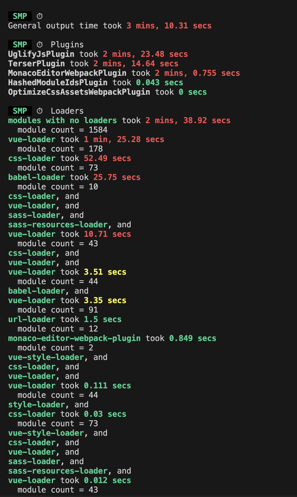
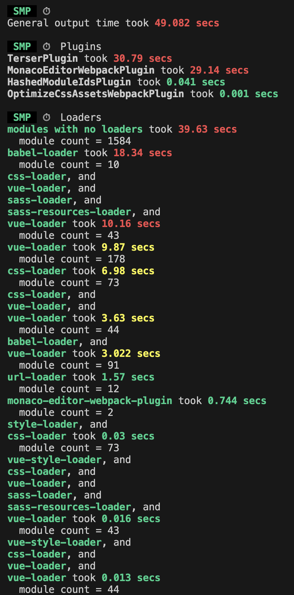
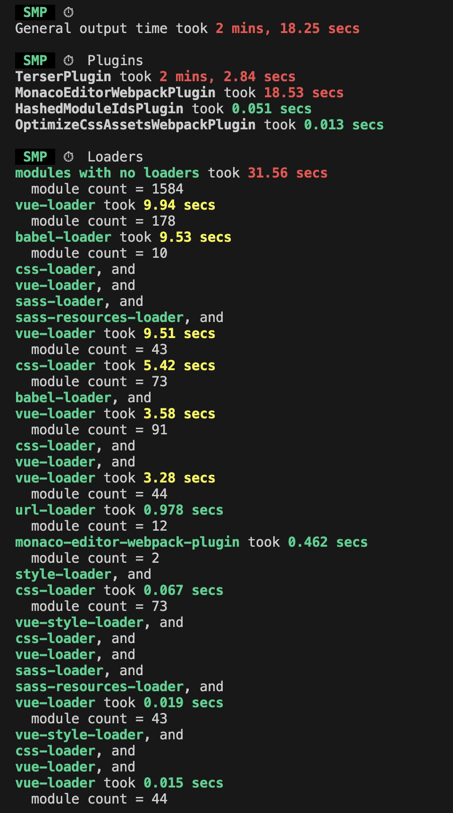
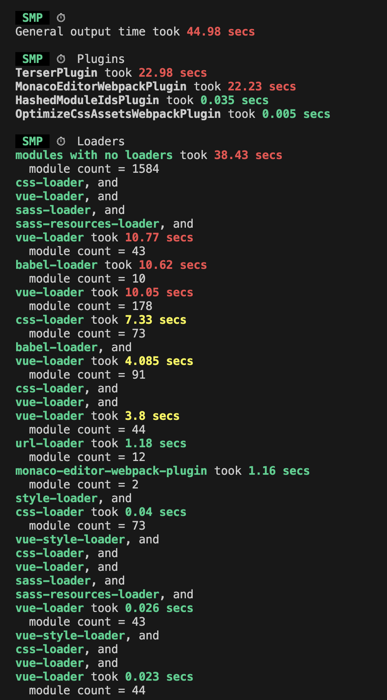
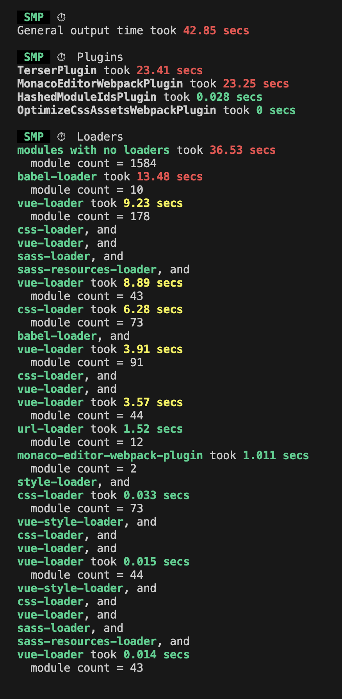
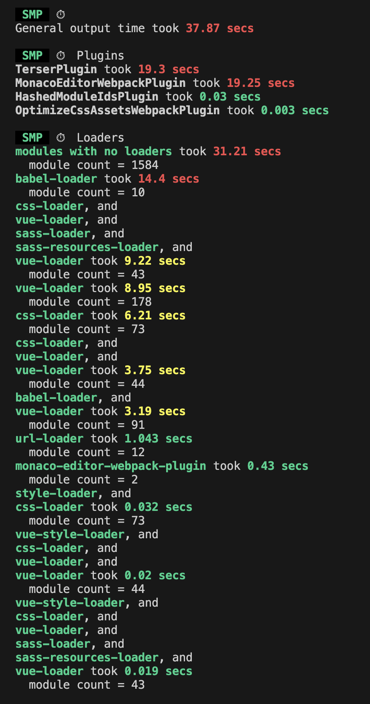
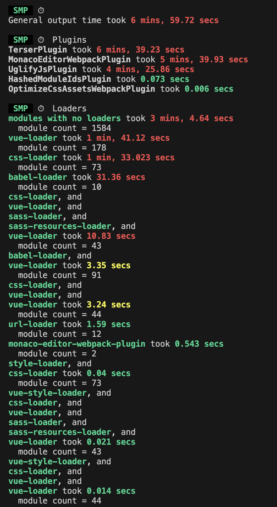
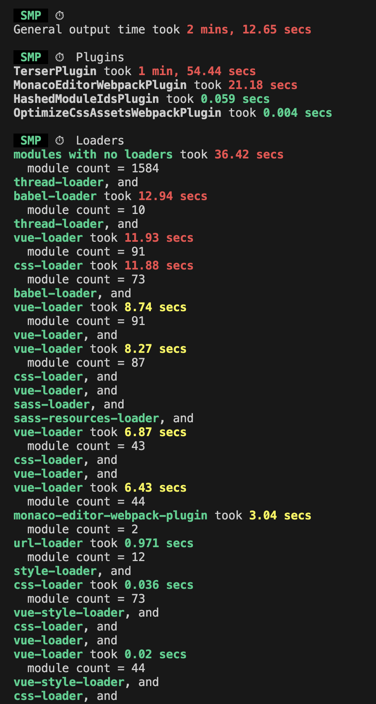

# 记录一次构建性能优化

背景：公司内项目，启动和构建速度很慢，想办法优化一下

## 速度分析：使用 speed-measure-webpack-plugin

```js
const SpeedMeasurePlugin = require("speed-measure-webpack-plugin");

const smp = new SpeedMeasurePlugin();

const webpackConfig = smp.wrap({
  plugins: [new MyPlugin(), new MyOtherPlugin()]
});
```

详细记录 output 时间，各 plugin，loader 运行时间

general output time 就是总的构建时间



发现大部分时间是被 UglifyJsPlugin, TerserPlugin 占用

这两个 Plugin 的作用就是压缩代码，压缩耗时太长

发现项目中部分代码用 UglifyJsPlugin 压缩，部分用 TerserPlugin 压缩，UglifyJsPlugin 已不再维护，TerserPlugin 完全可以替代 UglifyJsPlugin 完成压缩工作。

使用 TerserPlugin 进行压缩，并开启多线程压缩，默认并发数：**CPU 核心数 - 1**

## 并行压缩 多线程压缩

方法二：uglifyjs-webpack-plugin 开启 parallel 参数 （webpack4.0 以前推荐）

方法三：terser-webpack-plugin 开启 parallel 参数 （推荐）

```js
{
  minimizer: process.env.NODE_ENV == 'production' ? [
        // 压缩插件区分
        terserEntryNames.indexOf(entryName) < 0 ? new UglifyJsPlugin({ parallel: false }) : new TerserPlugin(),
        new OptimizeCSSAssetsPlugin({})
      ] : [],
}
// 修改后
{
  minimizer: process.env.NODE_ENV == 'production' ? [
        // 压缩插件区分
        new TerserPlugin({ parallel: true }),
        new OptimizeCSSAssetsPlugin({})
      ] : [],
}
```



构建时间明显缩短 190s => 49s

可能存在的风险

1. 内存消耗增加：每个线程都会占用一部分内存，如果你开启了很多线程，那么可能会消耗大量的内存。如果你的系统内存不足，那么可能会导致构建失败。
2. CPU 使用率增加：多线程会使得 CPU 使用率增加。如果你的 CPU 已经很繁忙，那么开启多线程可能会使得系统变得更加卡顿。
3. 不稳定性：虽然并行处理可以提高速度，但它也可能会引入一些不稳定性。例如，如果两个线程都试图修改同一个文件，那么可能会导致冲突。

## 开启缓存

TerserPlugin 可以开启缓存，没有修改的文件，就不需要重新压缩了

TerserPlugin 加上 cache，

```js
new TerserPlugin({ parallel: true, cache: true });
```

首次的时间

| 开启 cache 首次构建 | 第二次构建 |
| --- | --- |
|  |  |

Babel-loader 开 cacheDirectory，默认缓存目录在 node_modules/.cache/babel-loader

```js
{
  test: /\.(js|es6)$/,
  exclude: /(node_modules)/,
  loader: 'babel-loader',
  options: {
    cacheDirectory: true
  }
}
```

## 修改 extensions 顺序

修改 extensions 顺序 webpack 会按这个数组顺序去查找文件，将文件数量多的文件后缀放前面可以优化查找速度。

```js
resolve: {
  extensions: [".vue", ".ts", ".js", ".jsx", ".tsx"];
}
// 变成
resolve: {
  extensions: [".vue", ".js", ".ts", ".jsx", ".tsx"];
}
```



## externals 从输出的 bundle 中排除依赖 Vue，运行时再用 CDN 引入

从输出的 bundle 中排除依赖 Vue，运行时再用 CDN 引入

```js
externals: {
  vue: "Vue";
}
```



## 升级 webpack 到 v4 最新版本

webpack 版本越高性能越好，项目中原使用的是 webpack4 版本，考虑到 webpack5 会带来一些 break

```bash
npm install --save-dev webpack@4
```



## worker 池(worker pool)

`thread-loader` 可以将非常消耗资源的 loader 分流给一个 worker pool。

加上 thread-loader



结果时间反而更长。官网说：Use this loader only for expensive operations!

只在高开销的 loader 中使用，否则效果不好

## 使用 DllPlugin 预编译 Vue

```js
// 新建webpack.dll.config.js
const path = require("path");
const webpack = require("webpack");

module.exports = {
  entry: {
    vue: ["vue"]
  },
  output: {
    path: path.resolve(__dirname, "dist"),
    filename: "[name].dll.js",
    library: "[name]_library"
  },
  plugins: [
    new webpack.DllPlugin({
      name: "[name]_library",
      path: path.resolve(__dirname, "dist", "[name]-manifest.json")
    })
  ]
};
```

执行命令生成清单

```bash
webpack --config webpack.dll.config.js
```

```js
// webpack.config.js
const path = require("path");
const webpack = require("webpack");

module.exports = {
  // 其他配置...
  plugins: [
    // 其他插件...
    new webpack.DllReferencePlugin({
      context: __dirname,
      manifest: require("./dist/vue-manifest.json")
    })
  ]
};
```

时间变长了，不可取

## 结果比较

| 措施                                        | 结果               |
| ------------------------------------------- | ------------------ |
| 优化前（使用 speed-measure-webpack-plugin） |  |
| 升级 webpack 到 v4 最新版本                 |  |
| 开启多线程压缩 TerserPlugin                 |  |
| TerserPlugin 开启 cache                     |  |
| 修改 extensions 顺序                        |  |
| externals 去掉 vue 文件改用 CDN 引入        |  |
