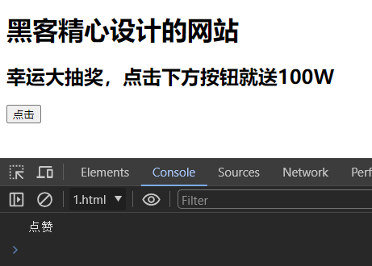
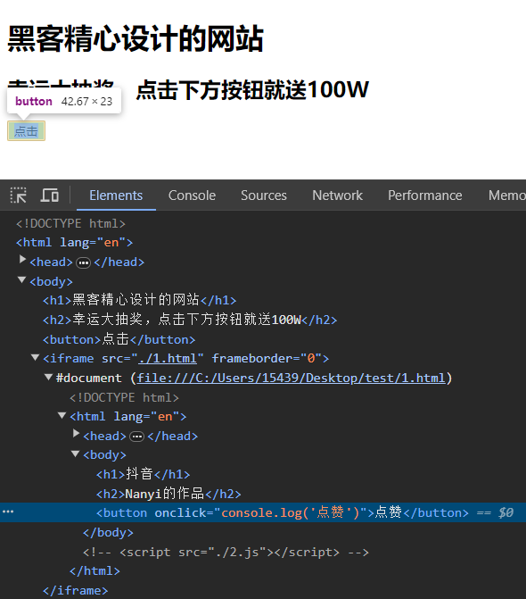

# 点击劫持防御

有个词叫做防不胜防，我们在通过iframe使用别人提供的内容时，我们自己的页面也可能正在被不法分子放到他们精心构造的iframe或者frame当中，进行点击劫持攻击。

这是一种欺骗性比较强，同时也需要用户高度参与才能完成的一种攻击。通常的攻击步骤是这样的：

1. 攻击者精心构造一个诱导用户点击的内容，比如Web页面小游戏
2. 将我们的页面放入到iframe当中
3. 利用z-index等CSS样式将这个iframe叠加到小游戏的垂直方向的正上方
4. 把iframe设置为100%透明度
5. 受害者访问到这个页面后，肉眼看到的是一个小游戏，如果受到诱导进行了点击的话，实际上点击到的却是iframe中的我们的页面

点击劫持的危害在于，攻击利用了受害者的用户身份，在其不知情的情况下进行一些操作。如果只是迫使用户关注某个微博账号的话，看上去仿佛还可以承受，但是如果是删除某个重要文件记录，或者窃取敏感信息，那么造成的危害可就难以承受了。

```html
<!-- 1.html -->
<body>
    <h1>抖音</h1>
    <h2>Nanyi的作品</h2>
    <button onclick="console.log('点赞')">点赞</button>
</body>
```

```html
<!-- 2.html -->
<style>
  iframe {
    position: absolute;
    top: 0;
    left: 0;
    width: 100%;
    height: 100%;
    opacity: 0;
  }
</style>
<body>
    <h1>黑客精心设计的网站</h1>
    <h2>幸运大抽奖，点击下方按钮就送100W</h2>
    <button>点击</button>
    <iframe src="./1.html" frameborder="0"></iframe>
</body>
```





## 如何防御

1. HTTP 标头 [`Content-Security-Policy`](https://developer.mozilla.org/zh-CN/docs/Web/HTTP/Headers/Content-Security-Policy)（CSP）中的 `frame-ancestors` 指令指定了指定可能嵌入页面的有效父项`iframe`。限制可以使用`iframe`嵌入我们的页面的父级的源
2. 使用X-Frame-Options：DENY这个HTTP Header来明确的告知浏览器，不要把当前HTTP响应中的内容在HTML Frame中显示出来。
3. 使用`SameSite=Strict`（或`Lax`）正确设置身份验证 Cookie，除非明确需要`None`（这种情况很少见） .
4. 在 UI 中使用防御代码来确保当前框架是最顶层窗口。

## 参考文章

https://cheatsheetseries.owasp.org/cheatsheets/Clickjacking_Defense_Cheat_Sheet.html#introduction