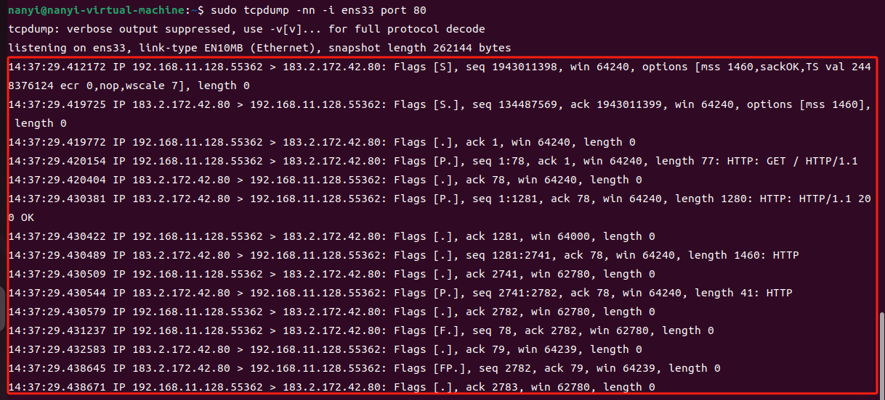
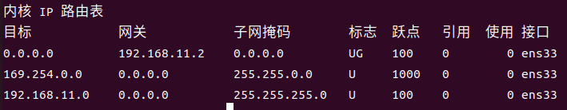

协议：就是约定，通信的双方根据约定好的数据格式进行通信

| OSI七层网络模型 | TCP/IP四层网络模型 | 协议                            |
| --------------- | ------------------ | ------------------------------- |
| 应用层          | 应用层             | HTTP，FTP，SMTP，DNS（基于UDP） |
| 表示层          |                    |                                 |
| 会话层          |                    | SSH、TLS/SSL                    |
| 传输层          | 传输层             | TCP、UDP                        |
| 网络层          | 网络层             | IP，ICMP，ARP                   |
| 链路层          | 网络接口层         | HDLC、PPP、帧中继               |
| 物理层          |                    | 蓝牙、wifi、Ethernet            |


TCP **面向连接**的**可靠**的传输协议

可靠性来自确认的机制

三次握手之后建立连接

双方开辟对应的资源，资源最终以一个变量的形式给程序使用

中间没有物理连接。这里的连接只是计算机认为自己与对方有了连接。

假设服务器被挂掉了，那在没有其他机制的情况下，客户端是不会知道服务器挂掉，客户端会认为连接依然存在

所以才有保活机制，keep-alive，也叫心跳机制。

上述三次握手之后开辟的资源就叫socket，也是程序调用的接口


socket 套接字 四元组

2048

4096 12

8192 13

```bash
# 监听 ip:端口 TCP 打开TCP连接
nc -l [ip] [port]
# 查看服务
netstat -natp
# 下载各种包
sudo apt install [packagename]


# 抓包 使用tcpdump命令监听80端口的网络流量，数据包
tcpdump -nn -i eth0 port 80
# 发请求
curl www.baidu.com
# 没权限可以用sudo执行命令
sudo tcpdump -nn -i eth0 port 80
# 设备不存在的话，查看网络接口的逻辑名称
sudo lshw -C network
# 重新执行
sudo tcpdump -nn -i ens33 port 80

# linux 系统使用nc可以建立TCP连接
nc 183.2.172.42 80 # 连百度
GET / HTTP/1.1

HTTP/1.1 200 OK
Accept-Ranges: bytes
Cache-Control: no-cache
Connection: keep-alive
Content-Length: 9508
Content-Type: text/html
Date: Thu, 28 Dec 2023 12:39:01 GMT
P3p: CP=" OTI DSP COR IVA OUR IND COM "
P3p: CP=" OTI DSP COR IVA OUR IND COM "
Pragma: no-cache
Server: BWS/1.1
Set-Cookie: BAIDUID=B66A19BA0DD03ACF17D40E90010D2A4F:FG=1; expires=Thu, 31-Dec-37 23:55:55 GMT; max-age=2147483647; path=/; domain=.baidu.com
Set-Cookie: BIDUPSID=B66A19BA0DD03ACF17D40E90010D2A4F; expires=Thu, 31-Dec-37 23:55:55 GMT; max-age=2147483647; path=/; domain=.baidu.com
Set-Cookie: PSTM=1703767141; expires=Thu, 31-Dec-37 23:55:55 GMT; max-age=2147483647; path=/; domain=.baidu.com
Set-Cookie: BAIDUID=B66A19BA0DD03ACFE9979DA8719CE57C:FG=1; max-age=31536000; expires=Fri, 27-Dec-24 12:39:01 GMT; domain=.baidu.com; path=/; version=1; comment=bd
Traceid: 1703767141131260929011035509107349970328
Vary: Accept-Encoding
X-Ua-Compatible: IE=Edge,chrome=1

<!DOCTYPE html><html><head><meta http-equiv="Content-Type" content="text/html; charset=UTF-8"><meta http-equiv="X-UA-Compatible" content="IE=edge,chrome=1"><meta content="always" name="referrer"><meta name="description" content="全球领先的中文搜索引擎、致力于让网民更便捷.......
```

[nc命令](https://wangchujiang.com/linux-command/c/nc.html)


四元组，只要有一个不相同就可以建立TCP连接

MTU（最大传输字节）代表一个数据包最大是多大 1500字节

MSS（最大分段大小）TCP段能接收的最大数据量，不包括TCP头和IP头


请求百度首页整个过程， 三次握手，客户端请求一个包，服务端响应数据分了三个包，每个包都有对应的ack包

| S    | Syn  |
| ---- | ---- |
| P    | Push |
| F    | Fin  |
| .    | ack  |




路由表，每个发出去的请求的 IP 都要与路由表内所有子网掩码做二进制与运算，以连接百度IP（183.2.172.185）为例：

183.2.172.185 会跟 路由表中三条子网掩码做与运算，

| 与表达式                      | 结果      | 目标         | 描述                                                         |
| ----------------------------- | --------- | ------------ | ------------------------------------------------------------ |
| 183.2.172.185 & 0.0.0.0       | 0.0.0.0   | 0.0.0.0      | 任何IP跟0.0.0.0做与运算都是0.0.0.0，表示这个是局域网的网关，与局域网外部的通信都可以发到这个地址 |
| 183.2.172.185 & 255.255.0.0   | 183.2     | 169.254.0.0  |                                                              |
| 183.2.172.185 & 255.255.255.0 | 183.2.172 | 192.168.11.0 |                                                              |

结果只有第一条与目标子网匹配，那就将请求发到网关192.168.11.2


如果IP是 192.168.11.21

| 与表达式                      | 结果       | 目标         | 描述                                                         |
| ----------------------------- | ---------- | ------------ | ------------------------------------------------------------ |
| 192.168.11.21 & 0.0.0.0       | 0.0.0.0    | 0.0.0.0      | 任何IP跟0.0.0.0做与运算都是0.0.0.0，表示这个是局域网的网关，与局域网外部的通信都可以发到这个地址 |
| 192.168.11.21 & 255.255.0.0   | 192.168    | 169.254.0.0  |                                                              |
| 192.168.11.21 & 255.255.255.0 | 192.168.11 | 192.168.11.0 |                                                              |

结果有第两条与目标子网匹配，当请求命中多个路由表条目时，通常会选择具有最长前缀匹配的路由条目。最长前缀匹配是指路由表中目的地地址与请求地址的最长匹配前缀。这意味着系统将选择与请求地址最匹配的路由表条目作为下一跳。这种方法确保了路由选择的准确性和有效性。当前就是选择 将请求发到 0.0.0.0 这代表目标主机在同个子网下，不需要通过路由器跳到下一跳




知道了下一跳的IP怎么把数据包发过去呢？目标IP写192.168.11.2，还是183.2.172.185呢？

答案是 183.2.172.185，那它怎么把数据包发给192.168.11.2 呢？在IP包外面再套一层，MAC头部。通过 ARP 协议获取对方的 MAC 地址。


