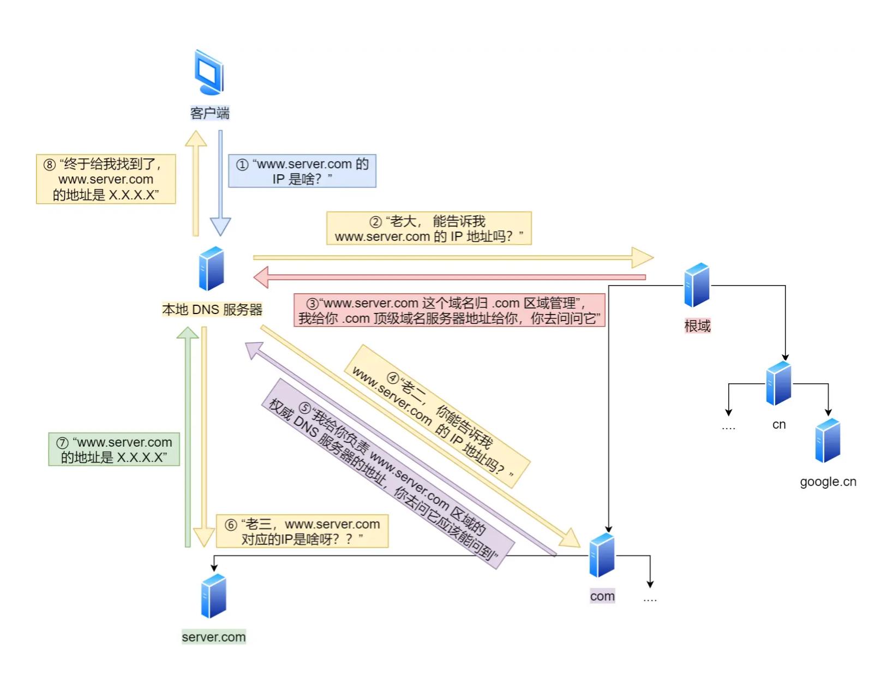
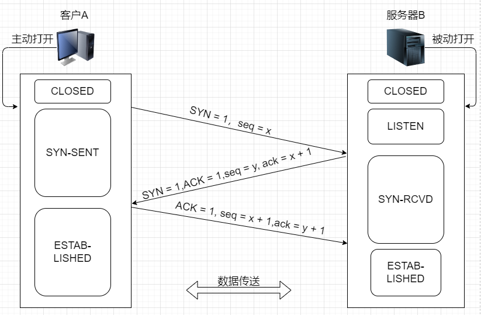
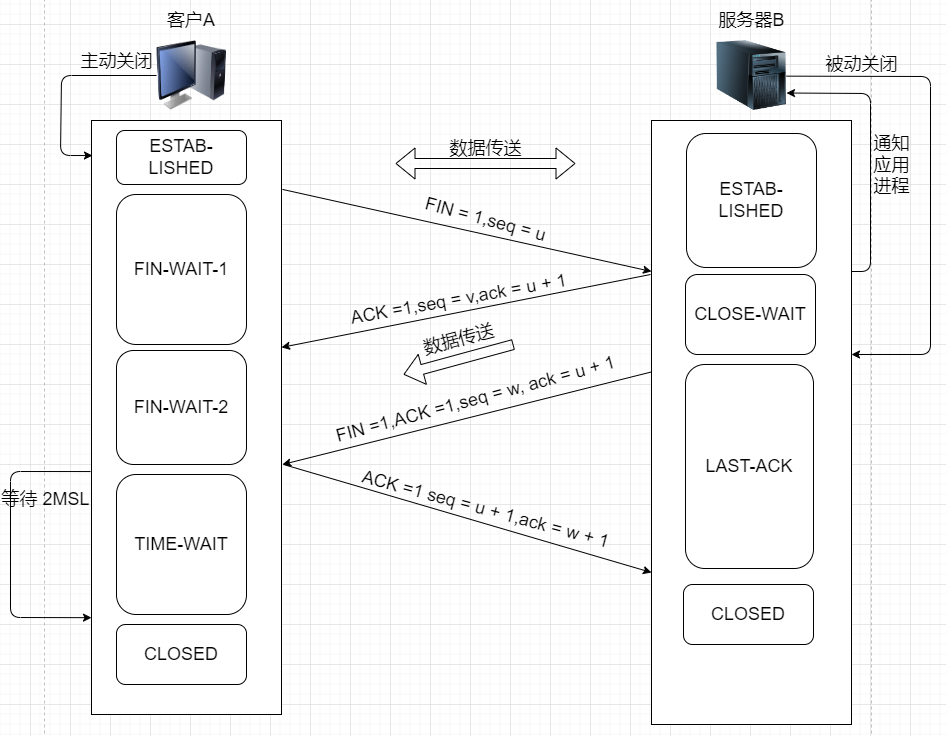
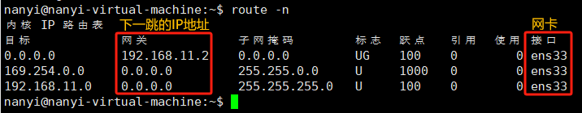
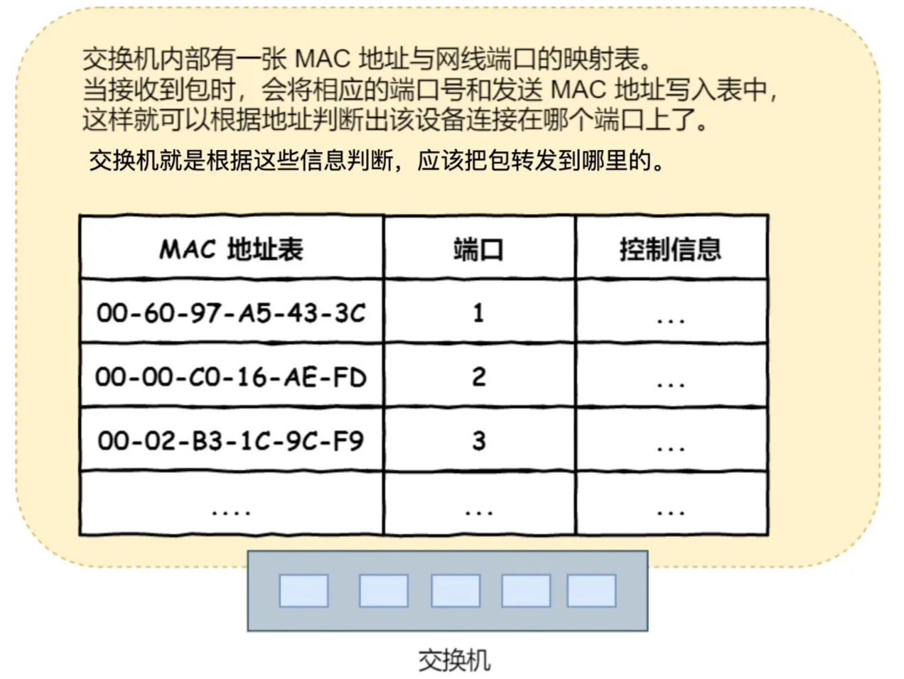

# 一、输入URL到网页显示期间发生了什么？

## 1、发起请求之前

### 1.1 用户输入

用户在浏览器地址栏栏输入内容，地址栏会判断输入的内容是搜索的关键字，还是请求的URL

+ 如果是搜索的关键字：地址栏会使用浏览器默认搜索引擎合成新的带搜索关键字的URL。
+ 如果是判断符合URL的规则，地址栏会根据规则，加上协议合成完整的URL。

由浏览器进程通过进程间通信IPC，将URL发送给网络进程

### 1.2 解析URL

获取到：协议、域名、端口、资源路径

<a href="#_1、解析url">解析URL</a>

### 1.3 查找缓存

查找本地缓存是否缓存了该资源如果有就直接返回资源，这通常涉及使用请求的URL作为键来查找缓存中的条目。

如果没有缓存，开始真正的请求流程。

<a href="./HTTP常见面试题.html#_2、http-缓存技术">HTTP缓存</a>

## 2、请求过程

### 2.1 构建HTTP请求信息

请求行（方法，资源路径、协议版本）、请求头（首部字段及其值）、请求体（GET请求一般为空）

### 2.2 DNS域名解析——查找IP

查询服务器域名对应的IP，会从缓存开始查询

1. 浏览器会先看自身有没有对这个域名的缓存，如果有，就直接返回；
2. 如果没有，就去问操作系统，操作系统也会去看自己的缓存，如果有，就直接返回；
3. 如果没有，再去 hosts 文件看，如果有，就直接返回；
4. 如果没有，发起 DNS 请求，进行域名解析

### 2.3 TCP——可靠传输

利用 IP 和 端口 建立TCP连接

<a href="#_3、tcp-握手和挥手流程">TCP握手与挥手</a>

### 2.4 TLS/SSL——安全传输

TLS 握手连接，在OSI七层模型中应该是属于会话层。

<a href="#_4、tls-握手">TLS
握手</a>

### 2.5 发送HTTP请求

HTTP数据包经过，拼接TCP头部，IP头部，Mac头部，报头和起始帧分隔符，FCS（检测错误的帧校验序列）

由网卡将数字信号转换成电信号，通过网线、交换机、路由器等物理设备发送到目的机器。

<a href="#_5、一个数据包的旅程">一个数据包的旅程</a>

### 2.6 服务端处理HTTP请求

解析请求报文的数据，构建响应报文，发送到客户端，断开连接

## 3、接收到响应数据

### 3.1 重定向

​		在接收到服务器返回的响应头后，网络进程开始解析响应头，如果发现返回的状态码是 301 或者 302，那么说明服务器需要浏览器重定向到其他的 URL。这时网络进程会从响应头的 Location 字段里面读取重定向的地址，然后再发起新的 HTTP 请求或者 HTTPS 的请求，一切又从头开始了。

### 3.2 响应数据类型处理

​		浏览器会根据 Content-Type 的值来决定如何显示响应体的内容。如果 Content-Type 的字段值被浏览器判断为下载类型，那么请求会被提交给浏览器的下载管理器，同时该 URL 请求的导航流程就此结束。但如果是 HTML，那么浏览器则会继续进行导航流程。

### 3.3 准备渲染进程

- 通常情况下，打开新页面都会使用单独的渲染进程；
- 如果从 A 页面打开 B 页面，且 A 和 B 都属于同一站点的话，那么 B 页面复用 A 页面的渲染进程；如果是其他情况，浏览器进程则会为 B 创建一个新的渲染进程。

### 3.4 提交文档

首先要明确一点，这里的**文档是指 URL 请求的响应体数据**。

- “提交文档” 的消息是又浏览器进程发出的，渲染进程接收到“提交文档”的消息后，会和网络进程建立传输数据的“管道”
- 等文档数据传输完成之后，渲染进程会返回“确认提交”的消息给浏览器进程
- 浏览器进程在收到“确认提交”的消息后，会更新浏览器界面状态，包括了安全状态、地址栏的 URL、前进后退的历史状态，并更新 Web 页面。

## 4、渲染流程

### 4.1 构建DOM树

浏览器无法直接理解和使用 HTML，所以需要将 HTML 转换为浏览器能够理解的结构——DOM 树。

### 4.2 样式计算

把CSS转换成浏览器可以理解的 styleSheet 层叠样式表，计算出DOM树每个节点的样式

### 4.3 布局阶段

结合DOM树和CSSOM树创建布局树

- 遍历 DOM 树中的所有可见节点，并把这些节点加到布局中；
- 而不可见的节点会被布局树忽略掉，如`head`标签下面的全部内容，再比如`body.p.span`这个元素，因为它的属性包含 `dispaly:none`，所以这个元素也没有被包进布局树
- 计算布局树节点的坐标位置

### 4.4 分层

为实现页面中一些复杂效果，例如复杂的 3D 变换、页面滚动，或者使用 z-indexing 做 z 轴排序。渲染引擎为特定的节点生成图层，并生成一棵图层树

### 4.5 图层绘制

会把图层绘制拆分成很多小的绘制指令，再把这些指令按照顺序组成一个待绘制列表

### 4.6 显示

绘制列表交给合成线程进行栅格化处理，最后显示到页面上

## 二、相关面试题

### 1、解析URL

**URL** 可以将 url 解析

**URLSearchParams** 可以解析 url 中的 search 参数部分

```js
/**
 * @param  {string} url
 * 利用 URLUtils 简单解析 URL
 * @returns {protocol, username, password, hostname, port, pathname, search, hash}
 */
function URLParser(url) {
  const urlObj = new URL(url);
  return {
    protocol: urlObj.protocol,
    username: urlObj.username,
    password: urlObj.password,
    hostname: urlObj.hostname,
    port: urlObj.port,
    pathname: urlObj.pathname,
    search: getUrlQueyr(urlObj.search),
    hash: urlObj.hash
  };
}

/**
 * @param  {string} search 类似于 location.search
 * @returns {object}
 */
function getUrlQueyr(search) {
  const searchObj = {};
  for (let [key, value] of new URLSearchParams(search)) {
    searchObj[key] = value;
  }
  return searchObj;
}
```

### 2、DNS 域名解析工作流程

以www.server.com为例

域名的组成结构：子域名.第二级域名.顶级域名

+ 根域名服务器：根域名服务器位于域名系统的最顶层，负责**存储顶级域名服务器的地址**。当本地域名服务器无法直接解析域名时，它会**向根域名服务器发送查询请求，以获取顶级域名服务器的地址**。
+ 顶级域名服务器：顶级域名服务器**负责存储权威域名服务器的地址信息**。当本地域名服务器接收到查询请求时，如果需要解析的域名属于特定的顶级域名，它会向相应的顶级域名服务器发送查询请求，**以获取权威域名服务器的地址**。
+ 权威域名服务器：权威域名服务器**存储特定域名的完整信息，包括该域名下所有子域名和主机记录的信息**。当本地域名服务器接收到查询请求时，如果需要解析的域名属于特定的权威域名服务器管理的域名，它会直接向该权威域名服务器发送查询请求，**以获取主机 IP**。

域名解析流程

1. 客户端发出DNS请求，询问 www.server.com 的IP，发到本地域名服务器；
2. 本地域名服务器，先在缓存中查找 www.server.com，如果有则它直接返回 IP 地址；如果没有就到根域名服务器查找；
3. 根域名服务器，返回顶级域名服务器的IP，本地域名服务器再访问顶级域名服务器；
3. 顶级域名服务器，返回权威域名服务器的IP，本地域名服务器再访问权威域名服务器；
3. 权威域名服务器，返回www.server.com 对应的IP地址。



### 3、TCP 握手和挥手流程

#### TCP三次握手



1. 开始客户端服务端都处于 CLOSED 状态，服务端主动监听某个端口，进入 LISTEN 状态
2. 客户端发送 TCP 连接请求，随机生成序列号，发送 SYN 报文（第一次握手），进入 SYN-SENT 状态。
3. 服务端接收到 SYN 报文，将客户端的序列号+1 作为确认号，随机生成序列号，发送 SYN-ACK 报文（第二次握手），进入 SYN-RCVD 状态。
4. 客户端收到 SYN-ACK 报文，序列号+1，将服务端的序列号+1 作为确认号，发送 ACK 报文（第三次握手），进入 establish 状态。
5. 服务端收到 ACK 报文，进入 establish 状态。

#### TCP四次挥手



1. 刚开始双方处于 establish 状态，客户端先发起关闭请求。
2. 客户端发送 FIN 报文（第一次挥手），消耗一个序列号，进入 FIN-WAIT-1 状态。
3. 服务端接收到 FIN 报文，将客户端序列号+1 作为确认号，发送 ACK 报文（第二次挥手），进入 CLOSE-WAIT 状态；此时 TCP 连接处于半关闭状态，即客户端到服务端方向已经没有数据要发送。
4. 客户端收到 ACK 报文，进入 FIN-WAIT-2 状态。
5. 服务端发送 FIN-ACK 报文（第三次挥手），并带上上一次的确认号，进入 LAST-ACK 状态。
6. 客户端收到 FIN 报文，将服务端序列号+1 作为确认号，发送 ACK 报文（第四次挥手），进入 TIME-WAIT 状态。
7. 服务端收到 ACK 报文，进入 CLOSED 关闭状态。
8. 客户端进入 TIME-WAIT 状态之后，等待 2MSL 的时间，没有收到服务端重传的 FIN 报文的话，证明 ACK 报文已被服务端接收，即可进入 CLOSED 状态。如果在 2MSL 时间内又收到服务端 FIN 报文，证明服务端未收到 ACK 报文，则重新发送 ACK 报文，重置 2MSL 的计时器。

### 4、TLS 握手

TLS建立连接的过程就是客户端向服务器索要并验证**CA公钥**，随后双方协商产生**会话密钥**的过程

#### 4.1 TCP三次握手

TLS 层是在 TCP 层之上的，所以在建立 TLS 连接之前，需要先建立 TCP 连接。

#### 4.2 CLient Hello

由客户端向服务端发起TLS连接请求，请求内容包含以下信息

+ 客户端支持的TLS/SSL协议版本。
+ 客户端生成的随机数（Client random），后面用于生成会话密钥的条件之一
+ 客户端支持的加密套件列表，如RSA等加密算法

#### 4.3 ServerHello

服务器收到客户端的建立请求后，向客户端发出响应，响应信息包含以下内容：

+ 确认TLS/SSL协议版本（如果浏览器不支持则关闭通信）
+ 服务器生成的随机数（Server random），也是后面生成会话密钥的条件之一
+ 确认的加密套件
+ 服务器的数字证书

#### 4.4 校验数字证书

见上面，数字签名。

#### 4.5 客户端回应

客户端从数字证书中取出服务器的公钥，然后使用它加密报文，向服务器发送以下信息：

1. Client Key Exchange：基于前面两个随机数（client random和server random）生成第三个随机数pre-master，然后用CA证书中的公钥，对pre-master进行加密
2. Change Cipher Spec：加密通信算法改变通知，表示客户端随后的信息都将用会话密钥加密通信
3. Encrypted handshake message：这一步对应的是client的Finish消息，client 将前面握手的消息生成摘要，再用协商好的**会话秘钥**进行加密，这是客户端发出的第一条加密消息， 服务端接收后会用**会话秘钥**解密，能解出来说明前面协商的秘钥是一致的，至此客户端的握手完成。

#### 4.6 服务端回应

服务端用自己的CA证书私钥对pre-master key解密得到pre-master，再计算出会话密钥，随后向客户端发送以下信息：

1. **Change Cipher Spec**：加密通信算法改变通知，表示服务端随后的信息都将用**会话秘钥**加密通信。
2. **Encrypted handshake message**：这一步对应的是 Server 的 Finish 消息，服务端会将握手过程消息生成摘要，然后再用**会话密钥**加密，这是服务器发出的第一条加密消息，客户端接收后会用**会话密钥**解密，能解出来就说明协商成功。

#### 4.7 TCP四次挥手

至此，整个TLS/SSL握手阶段结束，TCP四次挥手断开连接

接下来，客户端和服务器进入加密通信，完全使用普通的HTTP协议，只不过用会话密钥加密内容

### 5、一个数据包的旅程

应用程序构建好一个HTTP报文，

交给TCP处理，加上 TCP 头部（包含源端口，目的端口），HTTP 默认端口号是 `80`， HTTPS 默认端口号是 `443`。

交给 IP 处理，加上 IP 头部（包括源IP地址，目的IP地址），目的IP地址从 DNS 拿到；源IP地址的选择，用户的主机可能有多个网卡，对应多个IP地址，应该怎么选择？可以根据路由表，将目的IP地址与路由表内所有子网掩码做二进制与运算，得到的结果与对应条目的目标地址进行匹配，如果匹配成功，就使用条目对应的网卡`ens33`的 IP 地址作为源 IP 地址。



到这里，我们已经知道，目的IP地址和端口号，以及数据要从源IP地址对应的网卡发送出去。但是在以太网中，也就是物理世界还不知道下一步发到哪里？

交给链路层处理，加上 MAC 头部（包括发送方MAC地址，接收方MAC地址），发送方MAC地址就在主机网卡中读取出来即可，接受方的MAC地址怎么获得？查路由表可以得到**下一跳的目的IP地址**。（注意跟目的IP地址区分，目的IP地址是永远不会变的，由DNS获得）

ARP 协议在以太网中以广播的形式，发出包含**下一跳的目的IP地址**的 ARP 包，如果对方与自己处于同一个子网，并验证出IP地址是自己的，就会响应一个ARP包，包含其MAC地址。

网卡驱动获取网络包之后，会将其**复制**到网卡内的缓存区中，接着会在其**开头加上报头和起始帧分界符，在末尾加上用于检测错误的帧校验序列**。最后网卡将数字信号转换成电信号，通过网线发送出去。

电信号到达网线接口，交换机模块进行接收，**交换机的端口不具有 MAC 地址**。交换机工作在链路层，收到网络包之后，通过包末尾的 `FCS` 校验错误，如果没问题则放到缓冲区。查看MAC头部，看看接收方MAC地址，在不在自己的MAC地址表。如果在就将数据包发送到对应端口；如果不在，只能发到除源端口外的所有的端口，广播，等到目标设备作出响应，返回了响应包，交换机就将它的地址写入 MAC 地址表。



网络包经过交换机到达路由器，路由器各个端口都有 IP 地址和 MAC 地址。电信号到达网线接口部分，路由器中的模块会将电信号转成数字信号，然后通过包末尾的 `FCS` 进行错误校验。如果没问题则检查 MAC 头部中的**接收方 MAC 地址**，看看是不是发给自己的包，如果是就放到接收缓冲区中，否则就丢弃这个包。**MAC 头部的作用就是将包送达路由器**，其中的接收方 MAC 地址就是路由器端口的 MAC 地址。因此，当包到达路由器之后，MAC 头部的任务就完成了，于是 MAC 头部就会**被丢弃**。路由器会根据 MAC 头部后方的 `IP` 头部中的内容进行包的转发操作。查询**路由表**判断转发目标。将目的IP地址与路由表内所有子网掩码做二进制与运算，得到的结果与对应条目的目标地址进行匹配，如果匹配成功，就使用条目对应的网关作为下一跳 IP 地址，接下来需要通过 `ARP` 协议根据 IP 地址查询 MAC 地址，作为接收方 MAC 地址。发送方 MAC 地址字段，填写输出端口的 MAC 地址。

- 如果网关是一个 IP 地址，则这个IP 地址就是我们要转发到的目标地址，**还未抵达终点**，还需继续需要路由器转发。
- 如果网关为空，则 IP 头部中的接收方 IP 地址就是要转发到的目标地址，也是就终于找到 IP 包头里的目标地址了，说明**已抵达终点**。

发送出去的网络包会通过**交换机**到达下一个路由器。由于接收方 MAC 地址就是下一个路由器的地址，所以交换机会根据这一地址将包传输到下一个路由器。经过层层转发到达目标服务器。

服务器接收到网络包，查看 MAC 地址是自己的，拆掉 MAC 头部；查看 IP 地址，是自己的，拆掉 IP 头部；查看TCP 头部中的端口号，从该端口推送 HTTP 包给到应用程序。服务器再解读HTTP报文的内容。

**网络地址与端口转换 NAPT。** 解决IPv4地址不够用的问题。原理：NAT 路由器消耗一个 IP 地址，将 NAT 路由器每个端口都映射为一个私有 IP 地址。在发送数据包时，`192.168.1.10:80` 在路由器内就会被转换成对外的IP地址并占用一个端口`120.229.175.121:1025`


原来的情况，当内网机器要与外部通信，NAT 路由器就随机分一个端口出来，做一个映射，TCP连接存在时可以互相通信，当连接关闭了，这个端口也就回收了，那么就会导致外部机器想要访问内网机器，发到这个端口的时候，NAT 路由器认为我的这个端口没人使用，就把包丢弃了。

解决方案：

端口映射：让路由器永远记住这个端口收到的数据就发送给这台内网设备，不释放端口。内网设备变成主动方，内网设备从NAT设备获取公网 IP，并将自己的源IP地址端口，改成公网的IP和端口，这样当NAT设备接受到网络包的时候就不需要随机分一个端口了。这样外网设备就能访问内网设备。

内网穿透：利用第三方服务器，A 向 服务器发送请求，B 也向服务器发送请求，这样A B就能相互通信了


