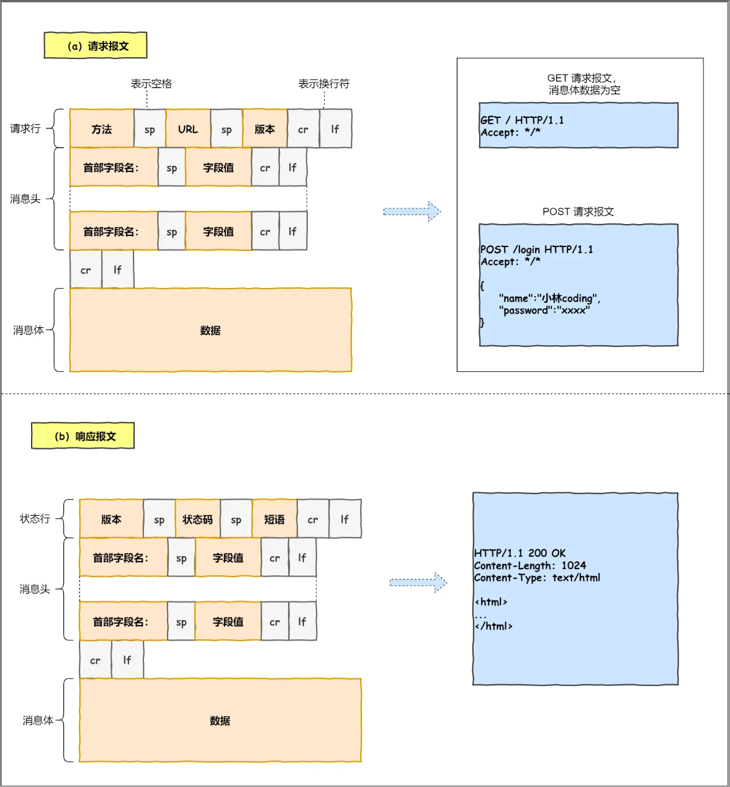

# HTTP常见面试题

## 1、HTTP请求报文结构

## 2、HTTP 状态码

`1xx` 类状态码属于**提示信息**，是协议处理中的一种中间状态，实际用到的比较少。

`2xx` 类状态码表示服务器**成功**处理了客户端的请求，也是我们最愿意看到的状态。

+ 「**101 Switchig Protocols**」该代码是响应客户端的 [`Upgrade` (en-US)](https://developer.mozilla.org/en-US/docs/Web/HTTP/Headers/Upgrade) 请求头发送的，指明服务器即将切换的协议。例如建立websocket连接

- 「**200 OK**」是最常见的成功状态码，表示一切正常。如果是非 `HEAD` 请求，服务器返回的响应头都会有 body 数据。
- 「**204 No Content**」也是常见的成功状态码，与 200 OK 基本相同，但响应头没有 body 数据。
- 「**206 Partial Content**」是应用于 HTTP 分块下载或断点续传，表示响应返回的 body 数据并不是资源的全部，而是其中的一部分，也是服务器处理成功的状态。

`3xx` 类状态码表示客户端请求的资源发生了变动，需要客户端用新的 URL 重新发送请求获取资源，也就是**重定向**。

- 「**301 Moved Permanently**」表示永久重定向，说明请求的资源已经不存在了，需改用新的 URL 再次访问。
- 「**302 Found**」表示临时重定向，说明请求的资源还在，但暂时需要用另一个 URL 来访问。

301 和 302 都会在响应头里使用字段 `Location`，指明后续要跳转的 URL，浏览器会自动重定向新的 URL。

- 「**304 Not Modified**」不具有跳转的含义，表示资源未修改，重定向已存在的缓冲文件，也称缓存重定向，也就是告诉客户端可以继续使用缓存资源，用于缓存控制。

`4xx` 类状态码表示客户端发送的**报文有误**，服务器无法处理，也就是错误码的含义。

- 「**400 Bad Request**」表示客户端请求的报文有错误，但只是个笼统的错误。
- 「**401 Unauthorized**」表示客户端未经身份验证。
- 「**403 Forbidden**」表示客户端没有访问内容的权限，它是未经授权的，因此服务器拒绝提供请求的资源。
- 「**404 Not Found**」表示请求的资源在服务器上不存在或未找到，所以无法提供给客户端。

`5xx` 类状态码表示客户端请求报文正确，但是**服务器处理时内部发生了错误**，属于服务器端的错误码。

- 「**500 Internal Server Error**」与 400 类型，是个笼统通用的错误码，服务器发生了什么错误，我们并不知道。
- 「**501 Not Implemented**」服务器不支持请求方法，因此无法处理。。
- 「**502 Bad Gateway**」通常是服务器作为网关或代理时返回的错误码，表示服务器自身工作正常，访问后端服务器发生了错误。
- 「**503 Service Unavailable**」表示服务器当前很忙，暂时无法响应客户端，类似“网络服务正忙，请稍后重试”的意思。
- 「**504 Gateway Timeout**」当服务器充当网关且无法及时获得响应时，会给出此错误响应。

## 3、HTTP 常见字段

### 请求头字段

*请求上下文*

+ **Host：`www.uuid.online`**       //请求的目标域名和端口号
+ **Origin：`http://localhost:8081`**  // 请求的来源域名和端口号（跨域请求时，浏览器会自动带上这个头信息）
+ **Referer：`http://localhost:8081/link?query=xxxx`** //请求资源的完整 URL
+ **User-Agent：Mozilla/5.0(Window NT 10.0;Win64;x64) AppleWebKit/537.36(KHTML, like Gecko) Chrome/67.0.3396.99Safari/537.36** // 浏览器信息

*内容协商*

+ **Accept: text/html,application/xhtml+xml,application/xml;q=0.9,*/*;q=0.8** // 代表客户端希望接受的数据类型
+ **Accept-Language: en-US,en;q=0.5** // 代表客户端希望接受的语言
+ **Accept-Encoding: gzip, deflate, br** // 代表客户端希望接受的压缩算法

*cookie*

+ **Cookie: BAIDUID=FA89F036:FG=1;BD_HOME=1;sugstore=0** //当前域名下的Cookie

*验证*

+ **Authorization：** // 包含用于向服务器验证用户代理身份的凭据。

*缓存*

+ **If-None-Match：W/"c5cafb35a5de8122ce0f8afc49443918"** // 协商缓存，校验资源是否更新
+ **If-Modified-Since：Mon, 18 Jul 2016 02:36:04 GMT** // 协商缓存，资源的最后修改时间

*连接管理*

+ **Connection: keep-alive** // 告诉服务器，客户端需要的tcp连接是一个长连接

### 响应头字段

- **Date: Mon, 30 Jul 2018 02:50:55 GMT** // 服务端发送资源时的服务器时间

*缓存*

- **Expires: Mon, 18 Jul 2016 02:36:04 GMT** // 资源缓存的过期时间
- **Last-Modified：Mon, 18 Jul 2016 02:36:04 GMT** // 协商缓存，资源的最后修改时间
- **Cache-Control：no-cache** // 现在使用最多的控制缓存的方式，会和服务器进行缓存验证
- **etag:"fb8ba2f80b1d324bb997cbe188f28187-ssl-df"** // 一般是Nginx静态服务器发来的静态文件签名，浏览在没有“Disabled cache”情况下，接收到etag后，同一个url第二次请求就会自动带上“if-None-Match” 协商缓存标识

*消息主体信息*

- **Content-Type: text/html; charest=utf-8** // 如果返回的是流式数据，就必须告诉浏览器这个头，不然浏览器会下载这个页面，同时告诉浏览器是utf8的编码，否则可能出现乱码
- **Content-Length: 277** //表明本次回应的数据长度。
- **Content-Encoding：gzip** // 告诉客户端，应该采用gzip对资源进行解码

*cookie*

+ **set-cookie: BAIDUID=FA89F036:FG=1;BD_HOME=1;sugstore=0** // 服务端设置cookie

*连接管理*

- **Connection：keep-alive** // 告诉客户端，服务器的tcp连接也是一个长连接

*CSP*

- **Content-Security-Policy: default-src 'self'; script-src 'self' \*.example.com; report-uri /_csp-report** //CSP内容安全策略

*重定向*

- **Location：** // 重定向

*CORS*

- **Access-Control-Allow-*:**  // CORS跨域资源共享相关

## 4、GET  和 POST区别

1. **浏览器回退表现不同** GET 在浏览器回退时是无害的，而POST会再次提交请求
2. **浏览器对请求地址的处理不同** GET请求地址会被浏览器主动缓存，而POST不会，除非手动设置
3. **浏览器对响应的处理不同** GET请求参数会被完整的保留在浏览器的历史记录里，而POST请求的参数不会被保留
4. **参数大小不同**GET请求在URL中传送的参数是有长度限制的，而POST没有限制
5. **安全性不同** GET参数通过URL传递，会暴露，不安全；POST放在Request Body中，相对更安全
6. **针对数据操作类型不同** GET对数据进行查询，POST主要对数据进行增删改！简单说，GET是只读，POST是写。
7. **GET 方法就是安全且幂等的**，POST不是

## 5、HTTP 缓存技术

第一次请求资源，浏览器根据响应头的缓存规则，将资源存入缓存，以URL为key，HTTP整个响应报文为value。

### 强制缓存

- 当浏览器第一次请求访问服务器资源时，服务器会在返回这个资源的同时，在 Response 头部加上 Cache-Control，Cache-Control 中设置了过期时间大小；
- 浏览器再次请求访问服务器中的该资源时，会先**通过请求资源的时间与 Cache-Control 中设置的过期时间大小，来计算出该资源是否过期**，如果没有，则使用该缓存，否则重新请求服务器；

在 HTTP/1.1 中，Cache-Control 是最重的规则，主要用于控制网页缓存，主要取值为：

- pubilc：所有内容都将被缓存（客户端和代理服务器都可缓存）
- private：所有内容只有客户端可以缓存，Cache-Control 的默认取值
- no-cache：客户端缓存内容，但是是否使用缓存需要经过协商缓存
- no-store：所有的内容都不会被缓存，即不使用强制缓存，也不使用协商缓存
- max-age=xxx (xxx is numeric)：缓存内容将在 xxx 秒后失效

### 协商缓存

- 当浏览器第一次请求访问服务器资源时，服务器会在返回这个资源的同时，在 Response 头部加上 ETag 唯一标识，这个唯一标识的值是根据当前请求的资源生成的；

- 当浏览器再次请求访问服务器中的该资源时，首先会先检查强制缓存是否过期：

  - 如果没有过期，则直接使用本地缓存；
  - 如果缓存过期了，会在 Request 头部加上 If-None-Match 字段，该字段的值就是 ETag 唯一标识；

- 服务器再次收到请求后，

  会根据请求中的 If-None-Match 值与当前请求的资源生成的唯一标识进行比较：

  - **如果值相等，则返回 304 Not Modified，不会返回资源**；
  - 如果不相等，则返回 200 状态码和返回资源，并在 Response 头部加上新的 ETag 唯一标识；

- 如果浏览器收到 304 的请求响应状态码，则会从本地缓存中加载资源，否则更新资源。

## 6、HTTP/1.1、HTTP/2、HTTP/3

### HTTP/1.1

*优点：*

1. **简单**：报文格式header+body，头部key-value
2. **灵活和易于扩展**：HTTP 协议里的各类请求方法、URI/URL、状态码、头字段等每个组成要求都没有被固定死，都允许开发人员自定义和扩充。下层协议也可随意变化
3. **应用广泛和跨平台**：广泛应用与浏览器、手机App

*缺点：*

1. **高延迟**：队头阻塞，顺序发送的请求序列中的一个请求因为某种原因被阻塞时，在后面排队的请求也会一并被阻塞，会导致客户端迟迟收不到数据
2. **无状态**：协议对连接状态没有记忆能力，导致每次请求都需要携带巨大的HTTP头部
3. **不安全**：明文传输，信息容易泄露；无校验机制，报文容易被篡改；无身份验证机制，服务端容易被冒充；
4. **不支持服务端推送**

*对 HTTP/1.0 的优化措施：*

1. **长连接**，解决每发一个HTTP请求就要建立一次TCP连接的问题，允许在一个TCP连接中发送多个请求。
2. **管道网络传输**：不需要等浏览器收到前一个HTTP请求的响应，才发下一个请求，允许同时发出多个HTTP请求，服务端只需按顺序响应即可。**解决请求的队头阻塞问题，没有解决响应的队头阻塞问题。**

### HTTP/2

*优点：*

1. **二进制传输**：整体报文被分为头信息帧和数据帧，二进制对机器十分友好解析很快，增加了数据传输的效率。
2. **Header 压缩**：开发了专门的“HPACK”算法，在客户端和服务器两端建立字典，用索引号表示重复的字符串，还采用哈夫曼编码来压缩整数和字符串，可以达到50%~90%的高压缩率。（解决无状态问题）
3. **多路复用**：针对不同的 HTTP 请求用独一无二的 Stream ID 来区分，接收端可以通过 Stream ID 有序组装成 HTTP 消息，不同 Stream 的帧是可以乱序发送的，因此可以并发不同的 Stream ，也就是 HTTP/2 可以并行交错地发送请求和响应。（TCP层还是一个一个数据包发送，每个包用Stream ID 区分属于哪个请求，接收到包之后，按 Stream ID 将包分类，并组装成完整HTTP报文）（解决队头阻塞）
4. **Server Push**：服务器根据客户端请求的资源，主动推送客户端接下来需要资源，节省消息传递的时间
5. **提高安全性**：基于 HTTPS，安全性有保障（解决安全性问题）

*缺点：虽然 HTTP/2 解决了很多以前旧版本的问题，但是它还是存在一个巨大的问题，主要是底层支撑的 TCP 协议造成的*

1. **TCP 以及 TCP+ TLS建立连接的延时**：在建立TCP连接的时候需要和服务器进行三次握手来确认连接成功，即需要消耗1.5个RTT之后才能进行数据传输；进行TLS连接，TLS有两个版本——TLS1.2和TLS1.3，每个版本建连所花的时间不同，大致是1~2个RTT；总之，在传数据之前我们需要花掉3~4个RTT。
2. **TCP 的队头阻塞没有完全解决**：在HTTP/2中，多个请求是跑在一个TCP管道中。但当出现丢包时，HTTP/2 的表现反而不如HTTP/1了，因为TCP为了保证可靠传输，有个丢包重传机制，丢失的包必须要等待重新传输确认，HTTP/2出现丢包时，整个TCP都要开始等待重传，**TCP 层必须保证收到的字节数据是完整且连续的，这样内核才会将缓冲区里的数据返回给 HTTP 应用**，那么就会阻塞TCP连接中所有的请求。对于HTTP/1.1来说，可以开启多个TCP连接，出现这种情况反倒只会影响其中一个连接，剩余的TCP还可以正常的传输数据
3. **多路复用导致服务器压力上升**
4. **多路复用容易timeout**

### HTTP/3

*对HTTP/2的优化措施：*

1. **无队头阻塞**：HTTP/2 虽然通过多个请求复用一个 TCP 连接解决了 HTTP 的队头阻塞 ，但是**一旦发生丢包，就会阻塞住所有的 HTTP 请求**，这属于 TCP 层队头阻塞。**HTTP/3 把 HTTP 下层的 TCP 协议改成了 UDP！**

2. **更快的连接建立：** HTTP/3 的 QUIC 协议并不是与 TLS 分层，而是 QUIC 内部包含了 TLS，它在自己的帧会携带 TLS 里的“记录”，再加上 QUIC 使用的是 TLS/1.3，因此仅需 1 个 RTT 就可以「同时」完成建立连接与密钥协商。
3. **连接迁移：** QUIC 协议没有用四元组的方式来“绑定”连接，而是通过 **连接 ID** 来标记通信的两个端点。只要仍保有上下文信息（比如连接 ID、TLS 密钥等），就可以“无缝”地复用原连接，消除重连的成本，没有丝毫卡顿感，达到了**连接迁移**的功能。

